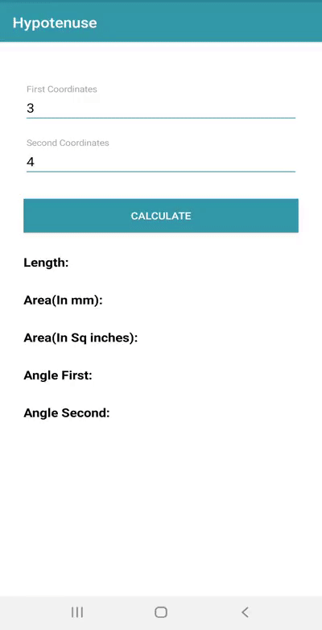
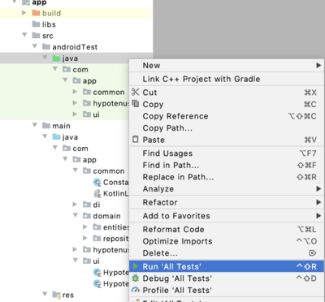
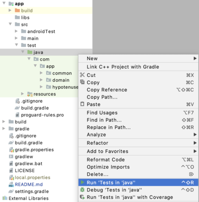

# Hypotenuse

This application is built to calculate the length of the hypotenuse, angles of the triangle and 
its area in square inches using __[Right Triangle Calculator](https://www.calculator.net/right-triangle-calculator.html?av=3&alphav=&alphaunit=d&bv=4&betav=&betaunit=d&cv=&hv=&areav=&perimeterv=&x=67&y=36)__.
To calculate application will accept two user inputs coordinates for lengths of the short sides 
of a right-angled triangle.

# Demo

## Languages, libraries and tools used

* __[Kotlin](https://developer.android.com/kotlin)__
* __[Koin](https://github.com/InsertKoinIO/koin)__
* __[Android Material Design](https://material.io/components/)__
* __[Android Architecture Components](https://developer.android.com/topic/libraries/architecture/index.html)__
* __[Instrumented Unit Testing](https://developer.android.com/training/testing/unit-testing/instrumented-unit-tests)__
* __[Espresso Testing](http://developer.android.com/training/testing/espresso)__

Above Features are used to make code simple, generic, understandable, clean and easily maintainable
for future development.Especially **Koin** for dependency injection

## Automated tests

To run the test you must connect to real device or an emulator then you can choose in one of the following ways:

1. To run a Android Instrumentation test, open the Project window, and then right-click a test and click Run.

2. To run Android Unit tests in a directory, right-click on the directory and select Run tests

## Running and Building the application

You can run the app on a real device or an emulator.

* __[Run on a real device](https://developer.android.com/training/basics/firstapp/running-app#RealDevice)__
* __[Run on an emulator](https://developer.android.com/training/basics/firstapp/running-app#Emulator)__

# Prerequisites
* __Android Studio 4.0__
* __Gradle version 4.0.0__
* __Kotlin version 1.3.72__
* __Android Device with USB Debugging Enabled__

# Built With

* __[Android Studio](https://developer.android.com/studio/index.html)__ - The Official IDE for Android
* __[Kotlin](https://developer.android.com/kotlin)__ - Language used to build the application
* __[Gradle](https://gradle.org)__ - Build tool for Android Studio